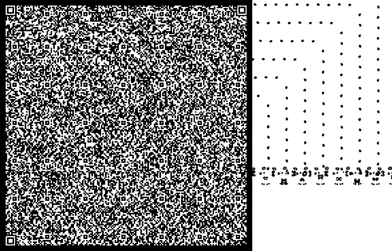

    <h1>Hi 🧙 I'm building a metaverse out of QR Codes</h1>
    
<small>For example: Here's a functional QR Code that contains a complete vibe coding agent. All in a single static, serverless HTML file: https://github.com/recursivefaith/qrx</small>

    

